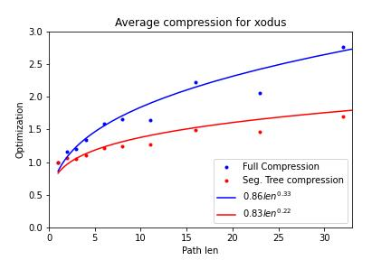
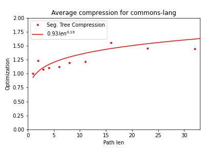

# Path compression

This document describes the idea of optimizing the algorithm for performing checkout queries by compressing tree paths.

This leads to decrease in time complexity of checkout query, with a cost of increase in extra memory used for storing the compressed paths.

## Motivation

The previous approach (described in [TrigramRevisionTree.md](https://github.com/SuduIDE/persistent-ide-caches/blob/main/TrigramRevisionTree.md)) was to perform the checkout query by ascending the commit tree from source and destination commit up to their LCA, recalculating the state of global data structure with deltas stored in edges. The problem with this solution is that it considers every edge on the path individually.

The idea is to optimize the algorithm by storing accumulated deltas for some vertical paths. Having done so, we can modify the checkout query as follows: first we compute `LCA` of source (`u`) and destination (`v`) commits by naive algorithm. Then, in order to recalculate the global data structure, instead of going up by one step from both vertices we will independently go from `u` and `v`.

When ascending from vertex to `LCA` we will split vertical path into some paths we precalculated, and combine their deltas. The idea of optimization is that some trigrams appear frequently, and therefore they will be stored in multiple edges in vertical path. If we compress some paths we will have to consider such trigrams only once, instead of every edge on the path. This idea is validated by experimental analysis described in [tree-analysis.md](https://github.com/SuduIDE/persistent-ide-caches/blob/main/tree-analysis.md))

## How paths are compressed

As described in aforementioned analysis, most of the vertices in commit trees have exactly one child, so it makes sense to consider every chain individually. Here, by chains we mean vertical paths between vertices of degree not equal to one.

Consider ascending during checkout query. Our path goes through some chains, until we reach the target node. Therefore, our goal is to precalculate path deltas in chains, such that every path passing through it decomposes into a small number of precalculated paths.

In order to achieve that, we build a Segment Tree over every chain. Every node of the Segment Tree corresponds to some subchain of our chain. For this subchain, we store accumulated deltas in memory.

## How to construct such Segment Tree
In order to construct such Segment Tree, we first split our edges into chains. To do that, we consider every vertex of degree not equal to one, and ascend from it until we reach another such vertex. The path between those vertices generates a new chain.

Now, for every chain, we construct Segment Tree. For every edge in path, we add its delta to every vertex it affects. Those vertices form a path from leaf of Segment Tree to root, and therefore there are only __O(log len)__ of them, where __len__ is a length of the chain.

Therefore, the total memory consumption of our data structure is __O(total_changes_size * log(number_of_commits))__. In practice, memory consumption is smaller, because some trigrams can appear in multiple edges in the chain, as described in *Motivation* section.

## How to perform checkout queries
In order to perform checkout from some commit `v` to commit `u`, we first find their `LCA` with naive algorithm described in [tree-analysis.md](https://github.com/SuduIDE/persistent-ide-caches/blob/main/tree-analysis.md). Then, we ascend from `v` to `LCA`, adding changes, and ascend from `u` to `LCA`, removing changes.

Every ascension is performed as follows: we start from vertex (let's call it `v`), and until we reach target node, we take subchain of a chain from `v` to deepest of path top and target node, split it into segment tree ranges, and update the result with stored deltas for those ranges.

Therefore, the checkout query works in time __O(log (number_of_trigram_files) * log(path_length) * depth)__, where __depth__ is a depth of tree with compressed chains into single edges. In practice, our algorithm works faster (because some trigrams occur in multiple edges).

## How to perform commit queries
In order to perform commit query, we need to add new leaf to a tree. There are two cases: our parent (let's call it `p`) was either a leaf or not leaf.

If `p` was a leaf we just attach this edge to parent chain, and recalculate Segment Tree nodes. If the length of the path becomes new power of two, we simply recalculate the whole structure. This recalculation amortizes to `O(1)`.

If `p` was not a leaf, we create new path consisting of only added edge, but we also need to split the chain consisting `p` into two chains. In fact, we can simply reassign chain parents for `p` and path end, and not change Segment Tree, because it will still be valid.

Therefore, commit query works in amortized time __O(delta_size * log(path_length))__.

## Calculation

We check our data structure on several GitHub repositories (see [tree-analysis.md](https://github.com/SuduIDE/persistent-ide-caches/blob/main/tree-analysis.md)).

For [xodus](https://github.com/JetBrains/xodus/), [commons-lang](https://github.com/apache/commons-lang), [soot](https://github.com/soot-oss/soot), [intellij-community](https://github.com/JetBrains/intellij-community) we compare the best compression as it was only one edge for each particular length (__O(n^3)__ memory) with our data structure (__O(nlog(n))__ memory). In particular, due to the edge compression, our memory is only __4.7__ times greater then the total number of vertices __n__, in opposite to __log2(n)=11.5__.

We see, that significant compression holds for all path lengths.

We also demonstrate the compression for [commons-lang](https://github.com/apache/commons-lang).

## Conclusion

Based on the theoretical estimations and experimental confirmation we conclude, that our data structure is efficient for any path length in time and memory complexity.