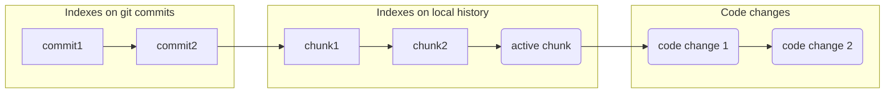

# Persistent immutable indexes for next-generation IDE

## Overview

Integrated Development Environment (**IDE**) is a great tool that increases software developer performance, 
providing **features** in addition to a plain text editor. 
To provide fast response time for many features, IDE requires **indexes**. For example, for a full-text search through 
all files in an opened project, one may want 
to use a [trigram index](https://en.wikipedia.org/wiki/Trigram_search) that is merely a map: `(char, char, char) -> 
list of files`. In contemporary IDEs (like Intellij IDEA) indexes are maintained for the current working copy only, i.e.
for current files on a file system (+ in-memory changes). The idea of this work is to create an efficient data 
structure that can hold indexes for the whole git repository (each commit) + local history + current working copy.

> Note, that for simplicity, you can classify IDE indexes like this:
> - The direct index is a map: `file -> something`. For example, the AST index contains a compressed abstract syntax 
	> tree for each file.
> - The inversed index is a map: `something -> list of files`. An example is the trigram index from above.
> - The general index is a map: `something1 -> something2`. For example, resolve index `symbol_usage -> 
	 symbol_declaration`.
> 
> Index type may influence internal index implementation due to performance considerations. For example, if your 
> indexes are stored on-disk (rather than in-memory) and you add **N** characters to a document it will require 
> only one *store access* into the AST index map, but O(N) store accesses for the trigram index map. 

## Motivation

Indexes for the git repository can be used by different next-generation IDE features such as the following.

#### Zero-time startup

If a developer wants to work with a specific git branch, then after checkout s/he needs to wait until all IDE indexes 
are 
processed (it can take several minutes) for this branch until index-based IDE features are available. But in case 
we have indexes for all commits, work can be started instantly. 

This also can be extremely important in Cloud IDE where the *client* is an editor, and the *server* contains a git 
repository, a working copy for each user, and indexes for all commits (+ delta for working copies). In the case of such 
a scenario, the developer only needs to do one click on a chosen commit to obtain a fully-functional IDE instantly 
(since 
indexes are already built for this commit). For local IDE, you can imagine cloning pre-build indexes from remote to the 
local machine as well as you clone the git repository.

#### Rich code review
Code review in dev-cloud tools like GitHub/GitLab is merely a diff between two text files with syntax coloring. No 
navigation features (like Go-To-Definition) are available for review. Even when you perform code review in local IDE, 
you have indexes for working copy only, so you can navigate and get code insights for a local copy but not for code 
from the git version you compare with. Since contemporary IDEs have no indexes for the old version, no diff-analysis 
is possible, other than text-based.

#### Search and navigation through history

[Navigate and search](https://www.jetbrains.com/help/rider/Navigation_and_Search__Index.html) features are extremely 
important in contemporary IDEs for code understanding. For example, the [Go to Class](https://www.jetbrains.com/help/rider/Navigation_and_Search__Go_to_Class.html) feature allows you to navigate 
to any class you want by 
typing the substring of the name of the class you want to find. 

One may think about the *historical* `Go to class` feature that allows one to see all classes that existed in history. 
Ranking such search results is a separate task. Linking the old class name to the new class name is also a very 
interesting topic that allows a developer to better understand code modifications, but it's beyond the scope of this 
research.

#### And many others
One may imagine tons of useful features that can be available for code history exploration as soon as we get indexes 
for all commit history. Presumably, it can be a breakthrough in code history understanding and history-based code 
analysis. Indexes are the solid fundament for future R&D work.

## Scope of work

In this research, you are required to develop on-disk persistent, immutable, thread-safe, time/space efficient, and 
potentially horizontally scalable data structures that can hold IDE indexes for **both** *git repository commits* 
**and** *working copy* **simultaneously**. Let's consider all these requirements in detail:

#### On-disk persistent
While in-memory data structures can be more performant they have a sufficient drawback in the case of IDE indexes.
  - Memory is often limited in a typical developer's local machine. 8/16 GB is now merely a standard. An in-memory 
	solution can't be supported for big projects — it will lead to out-of-memory errors.
  - *Zero-time startup* requirement can't be achieved. If you do not serialize in-memory data structure between IDE 
	runs, you'd need to recalculate indexes on each run. If you serialize in-memory indexes to disk then you need to 
	deserialize it back on each run (it takes time), and also serialization points are not obvious (you can't do it 
	on close because nothing will be saved if the process terminated unexpectedly).
  
Some hybrid solution is expected from you here. Most of the information is on-disk and some frequently used 
information is cached in the in-memory data structures. Additionally, you may take into account that we want to index 
not 
only commits but also the current working copy (that can be imagined as text deltas in touched files over the last 
commit).

#### Thread-safe and immutable
The index data structure should provide thread-safe API to be read and written from 
different threads. 
Additionally, some features may want to work with a stale version of indexes (say, `Go to class` feature still 
calculates classes on the 1-sec-ago version while the user types several characters in the editor — it will lead to 
index recalculation). So in a theoretical model, every user change (like typed char) can be considered as a commit with 
an index version associated with it. In practice, it's extremely inefficient, so we may want to separate user inputs 
into [debounced](https://css-tricks.com/debouncing-throttling-explained-examples/) chunks. Chunks allow to organize 
`Local history` feature — considering debounced code changes as separate commits and searching through them. We can 
think about layered and versioned structures here and indexes must be available for each node in this graph:

There is no need to keep indexes for all `code changes` indefinitely. If no feature uses indexes for change, an index 
can be dropped and change can be added to the `active chuck`. A garbage collection procedure must be proposed by the 
index API. A new `active chuck` can be created if the user is inactive for 1 minute or performed big refactoring 
(depends on local history policy).

It seems like [Persistent/immutable data structures](https://en.wikipedia.org/wiki/Persistent_data_structure) can 
solve this task well, but it requires additional research. With *on-disk* and *performance* requirements this task becomes challenging.

#### Time/space efficient

You can imagine a simple way to solve the aforementioned requirements by indexing all source files for each commit (and 
each code change in the working copy). This is extremely inefficient and impractical for the following reasons:
- **Space required.** If we have **N** commits (+ code changes) and the index size for each commit is **M** bytes, such 
  index structure consumes **O(N*M) bytes**.
- **Rebuild time required.** If for each change we recalculate the index for all files, it will be impractical to wait 
  for the developer. Incrementality is required.
- **Historical features performance.** Historical `Go to class` feature will be extremely slow for such index 
  organization.

So we require to organize indexes in such a way that time to reindex is **O(change_size_in_bytes)** and space consumed 
must not be more than **O(change_size_in_bytes * log(all_changes_in_bytes))**. Also, the feature's response time should
not be more than **O(log(all_changes_in_bytes))**. Not only algorithmic complexity but the constant factor is very 
important 
for performance: the log base must be sufficiently big, say, 512 instead of 2 (it's a branching factor for B-tree, 
but it depends on data structure implementation). Strings must be interned as much as possible to keep space. Though 
we don't have exact numbers for the constant factor, we assume you will try to compress every data structure as much as 
possible.

#### Horizontally scalable (future research direction)

> Note: This is an extra task, we do not require it from this research work, but it would be nice to have a feature. 
The ideal solution for index data structures must be infinitely scalable:
- It must be **distributed**, so data structures should work and synchronize across several virtual machines in 
  a cluster/cloud.
- It must be **sharded**. If the total data structure size is **S** and we have **N** VMs in a cluster, the data 
  structure 
  part on one machine should consume **O(S/M)** disk.
- It must be **scalable**. If you add additional VMs, the performance of requests to this data structure should 
  increase.

## Plan

What you need to do is the following:
 - Discuss your ideas with us to prove you understand the scope well and the direction of your research is aligned with 
   our needs. Please store the results of these discussions in the `Requirements.md` document and 
   we shall validate them.
 - Propose your design in the `Design.md` document with proof of your ideas.
 - Provide a prototype of index data structure.
 - Develop a prototype for `Go to class` and `Full-text search` features in the demo product (e.g. based on VSCode or 
   Intellij IDEA).
 - Integrate such indexes into SuduIDE. The exact integration strategy will be discussed.
 - Regularly (1 day/week) attend alignment meetings.
 
#### `Go to class` feature
While `Full-text search` is a rather simple feature with trigram index, `Go to class` requires much more research. `Go 
to class` uses sophisticated ranking among class candidates that match the user input. For example,  
`InternetProtocol` matches better to `ip` input than `Hippy` class. You need to define this ranking by yourself 
(one way is to study Intellij IDEA sources) and adopt a data structure to solve the ranking problem with maximum 
performance. The developed feature must be compared with the `Go to class` feature in Intellij IDEA working on real 
solutions. 

#### Evaluation

We propose to do performance evaluation on some real open-source projects such as
- [Intellij IDEA Community](https://github.com/JetBrains/intellij-community)
- [Soot analysis framework](https://github.com/soot-oss/soot)
- [Apache commons-lang](https://github.com/apache/commons-lang)

Time for one navigation request must be measured and be not more than **20ms** on a typical developer machine: 
*Intel i9 2Hz, 16GB RAM*. In-memory index part must not use more than 1Gb in RAM.
On-disk and in-memory space required by the index must be measured in proportion to corresponding change sizes: 
`all_changes_in_repository_in_java_files` for `Full-text search` and `all_class_names` for `Go to file`. 
