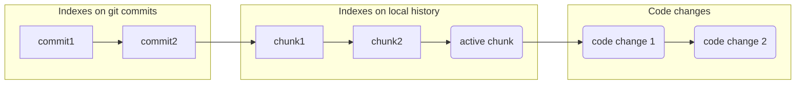

# Persistent immutable indexes for next generation IDE

## Overview

Integrated Development Environment(**IDE**) is a great tool that increases software developer perfromance, providing **features** in addition to plain text editor. 
In order to provide fast response time for many features, IDE requires **indexes**. For example, for full text search through all files in opened project, one may want 
to use [trigram index](https://en.wikipedia.org/wiki/Trigram_search) that is merely a map: `(char, char, char) -> list of file`. In contemporary IDEs (like IntellijIDEA) indexes are maintaned for current working copy only, i.e.
for current files on file system (+ in-memory changes). The idea of this work is to create efficient data structure that can hold indexes for whole git repository (each commit) + local history + current working copy.

> Note, that for simplicy, you can classify IDE indexes like this:
> - Direct index is a map: `file -> something`. For example, AST index that contains compressed abstract syntax tree for each file.
> - Inversed index is map: `something -> list of files`. Example is trigram index from above.
> - General index is a map: `something1 -> something2`. For example resolve index `symbol_usage -> symbol_declaration`
> 
> Index type may influence internal index implementation due to performance consideration. For example, if you indexes are stored on-disk (rather than in-memory) and you add **N** characters into document it will require only one *store access* into AST index map, but O(N) store accesses for trigram index map. 

## Motivation
Indexes for git repository can be used by different next generation IDE features such as:

#### Zero-time startup
If developer wants to work with specific git branch, then after checkout he needs to wait until all IDE indexes are processed (this can take several minutes) for this branch until index-based IDE features will be available. But in case we have indexes for all commits, work can be started instanly. 

This also can be extremely important in Cloud IDE where *client* is an editor, and *server* will contain git repository, working copy for each user and indexes for all commits (+ delta for working copies). In case of such scenario, developer only need to do 1 click on chosen commit to obtaint fully-functional IDE instantly (since indexes are already built for this commit). For local IDE, you can imagine to clone pre-build indexes from remote to local machine as well as you clone git repository.

#### Rich code review
Code review in dev-cloud tools like GitHub/GitLab is merely a diff betwen two text files with syntax coloring. No navigation features (like Go-To-Definition) is available for review. Even when you perform code review in local IDE, you have indexes for working copy only, so you can navigate and get code insights for local copy but not for code from git version you compare with. Since contemporary IDEs have no indexes for old version, no diff-analysis are possible, other than text-based.

#### Search and navigation through history

[Navigate and search](https://www.jetbrains.com/help/rider/Navigation_and_Search__Index.html) features are extremely important in contemporary IDEs for code understanding. For example [Go to class](https://www.jetbrains.com/help/rider/Navigation_and_Search__Go_to_Class.html) feature allows you to navigate to any class you want by typing substring of name of class you want to find. 

One may think about *histotical* `Go to class` that will allow to see all classes existed in history. Ranking of such search result is a separate task. Linking of old class name to new class name is also a very interesting topic that allow developer to better understand code modifications, but it's beyond the scope of this research. 

#### And many others
One may imagine tons of useful features that can be available for code history exploraion as soon as we get indexes for all commit history. Presumably, it can be a breakthrough in code history understanding and history-based code analysis. Indexes are definately the solid foundament for future R&D work.

## Scope of work

In this research you are required to develop on-disk persistent, immutable, thread-safe, time/space efficient and potentially horizontably scalable datastructures that can hold IDE indexes for **both** *git repository commits* **and** *working copy* **simultaneously**. Let's consider all these requirements in details:

#### On-disk persistent
While in-memory datastructures can be more performant they have sufficient drawback in case of IDE indexes.
  - Memory is often limited in typical developer's local machine. 8/16 GB is now merely a standard. In-memory solution can't be supported for big projects - it will lead to out-of-memory errors.
  - *Zero-time startup* requirement can't be achived. If you do not serialize in-memory datastructure between IDE runs, you'd need to recalculate indexes on each run. If you serialize in-memory indexes to disk then you need to deserialize it back on each run (it takes time), and also serialization points are not obvious (you can't do it on close because nothing will be saved if process terminated unexpectedly)
  
Some hybrid solution is expected from you here. With most of information is on-disk and some frequently used information is cached in in-memory datastructures. Additionally you may take into account that we want to index not only commits but also current working copy (that can be imagined as text deltas in touched files over last commit).

#### Thread-safe and immutable
Indexes datastructure will definately should provide thread-safe API to be read and written from different threads. Additionally some features may want to work with stale verion of indexes (say `Go to class` feature still calculates classes on 1-sec-ago version while user typed several characters on his editor and thus lead to index recalculation). So in theoretical model every user change (like typed char) can be considered as commit with index version associated with it. On practice it's extremely inefficient so we may want to separate user inputs into [debounced](https://css-tricks.com/debouncing-throttling-explained-examples/) chunks. Chunks allows to organize `Local history` feature - considering debounced code changes as separate commits and search through them. We can think about layered and versioned structure here and indexes must be avaialble for each node in this graph:

The is no need to keep indexes for all `code changes` indefinetely. If no feature uses indexes for change, index can be dropped and change can be added to the `active chuck`. Some garbage collection procedure must be proposed by index API. New `active chuck` can be created if user is inactive for 1 minute or performed big refactoring (depends on local history policy).

It seems like [Persistent/Immutable data structures](https://en.wikipedia.org/wiki/Persistent_data_structure) can solve this task well, but it requires additional research. With *on-disk* and *performance* requirements this tasks becomes challenging.

#### Time / space efficient

You can imagine simple way to solve aforementioned requirements by indexing all source files for each commit (and each code change in working copy). This is extremely inefficient and impractical by following reasons:
- **Space required.** If we have have **N** commits (+ code changes) and index size for each commit is **M** bytes, such index structure consumes **O(N*M) bytes**
- **Rebuild time required.** If for each change we recalculate index for all files, it will be impactical to wait for developer. Incrementality is required
- **Historical features performace.** Historical `Go to class` feature will be extremely slow for such index organization

So we require to organize indexes such way that time to reindex is **O(change_size_in_bytes)** and space consumed must not more than O(change_size_in_bytes * log(all_changes_in_bytes)). Also feature's response time should be not more that O(log(all_changes_in_bytes)). Not only algorithmic complexity but constant factor is very important for performance: log base must be sufficiently big, say 512 instead of 2 (say it's branching factor for B-tree, but it's depends of data structure implementation). Strings must be interned as much as possible to keep space. Though we don't have exact numbers for constant factor, we assume you will try to compress every data structure as much as possible.

#### Horizontably scalable (future research direction)

> Note: This is extra task, we do not require it from this research work, but it'd be nice to have feature. 
Ideal solution for index datastructures must be infinitely scalable:
- It must be **distributed**, so data structures should work and synchronize across several virtual machine in cluster/cloud.
- It must be **sharded**. If total datastructure size if **S** and we have **N** VMs in cluster, datastructure part on one machine should consume **O(S/M)** disk.
- It must be **scalable**. If you add additional VMs, performace of requests to this datastructure should increase.

## Plan 
What you need to do is:
 - Discuss your ideas with us to prove you understand scope well and direction of your research is aligned with our needs. Results of such discussions must be stored by you in `Requirements.md` document and validated by us.
 - Propose design in `Design.md` document with prove of your ideas
 - Provide prototype of indexes datastructure
 - Develop prototype for `Go to class` and `Full text search` features in demo product
 - Integrate such index 
 
#### `Go to class` feature
While `Full text search` is rather simple feature with trigram index, `Go to class` requires much more research. `Go to class` uses sofisticated ranking among class candidates that matches to user input. For example  `InternetProtocol` matches better to `ip` input than `Hippy` * class. You need to define this ranking by yourself (one way is to study IntellijIDEA sources) and adopt data structure to solve ranking problem with maximum performance. Developed feature must be compared with IntellijIDEA's `Go to class` on real solutions. 

#### Evaluation
We propose to do performace evaluation on some real open source project such as
- [Intellij IDEA Community](https://github.com/JetBrains/intellij-community)
- [Soot analysis framework](https://github.com/soot-oss/soot)
- [Appache commons-lang](https://github.com/apache/commons-lang)

Time for 1 naviagation request must be measured an be not more than **20ms** on typical developer machine: *Intel i9 2Hz, 16GB RAM*. In-memory index part must not use more that 1Gb in RAM.
On-disk and in-memory space required by index must be measured in proportion to corresponding change sizes: `all_changes_in_repository_in_java_files` for full-text-search and `all_class_names` for `Go to file`. 
