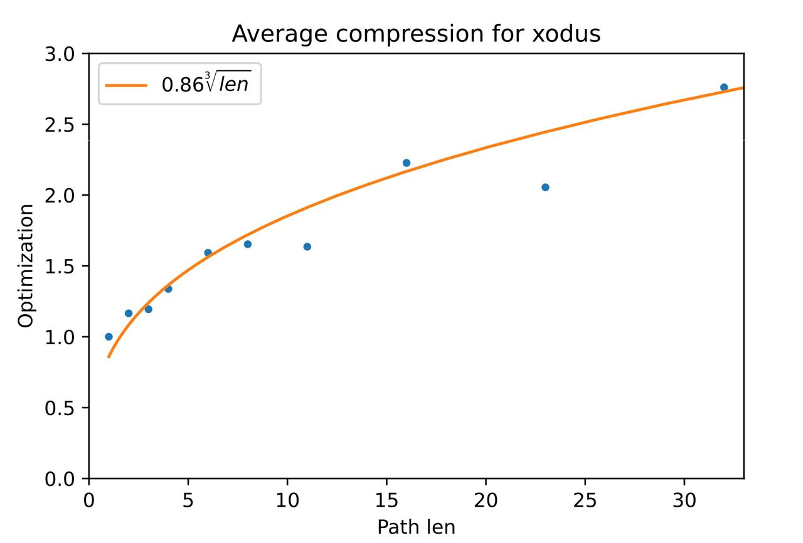
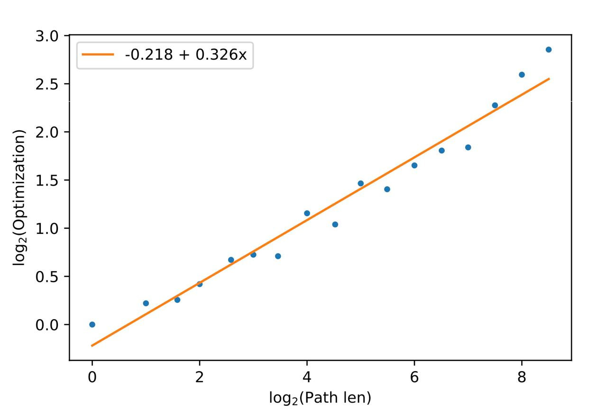

# Analysis of GitHub repository tree structure

In order to determine how the future algorithm will perform, it was decided to perform an analysis of some open-source repositories. Those included [xodus](https://github.com/JetBrains/xodus/), [commons-lang](https://github.com/apache/commons-lang), [soot](https://github.com/soot-oss/soot), [intellij-community](https://github.com/JetBrains/intellij-community).

## Analysis of tree structure

For every beforementioned repository we constructed a tree of all the commits, including all branches. To analyze this tree we calculated the degree distribution of those trees. The results are as follows (degree means the number of children in a tree):

### Xodus

Degree 0: 12

Degree 1: 2924

Degree 2: 5

Degree 3: 3

### Commons-lang

Degree 0: 80

Degree 1: 7437

Degree 2: 77

Degree 3: 1

### Soot

Degree 0: 42

Degree 1: 7308

Degree 2: 37

Degree 3: 2

### IntelliJ-Community

Degree 0: 1571

Degree 1: 477143

Degree 2: 1346

Degree 3: 80

Degree 4: 8

Degree 5: 4

Degree 6: 3

Degree 10: 1

## Conclusions

Based on the results, we conclude that most of the vertices have degree equal to one, so our tree looks like a bunch of chains. The developed algorithm should account for this fact.

# Analysis of path compression on GitHub repositories
In order to determine whether the algorithm of compressing vertical paths can be applied, it was decided to measure how much performance is gained on real-world open-source repositories.
The testing was performed on the [xodus](https://github.com/JetBrains/xodus/) repository.

## Method

The analysis works as follows. For every length __L__ of compressed path, we pick some number of random vertices in commit tree. For every picked vertex __v__ we measure the ratio __P/Q__, defined as follows:

__P__ = sum of number of trigram/file entries in all edges from vertex __v__ to it's __L__'th parent.
__Q__ = number of trigram/file entries in a total delta from vertex __v__ to it's __L__'th parent.

Basically, ratio __P__ denotes how faster it is to use a compressed edge instead of naively processing the whole path.

Then we take average of __P/Q__ over all picked vertices, and consider the resulting value as a compression value for picked __L__. Here is the plot of __P/Q__ versus __L__ (Lengths up to 30):

Here is the same plot with all observations in log-scale:

Orange curves in both plots show the best approximation for the given points. We can see that points fill well in the curve of order of cubic root of length, which is a line in log scale.

## Conclusions

Based on the results, we conclude that compression of vertical paths leads to a significant optimization.